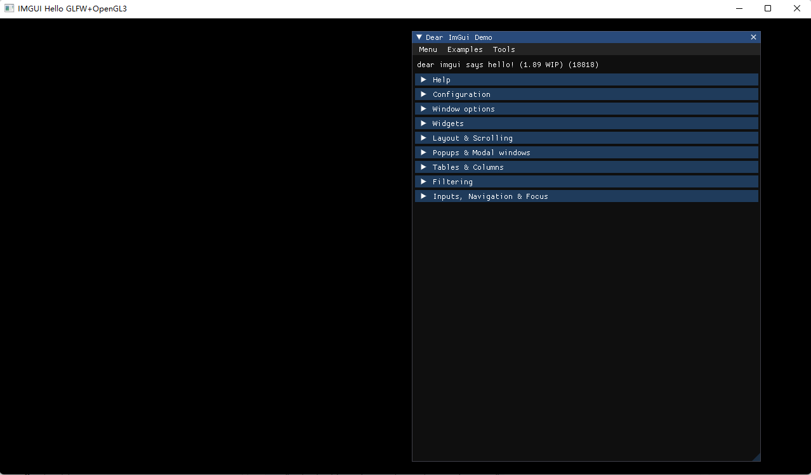

# Dependencies.imgui

This is a gui library to write you own UI layer in C++

No specific build process is required. You can add the .cpp files to your existing project.

## Backend

Each backedn is typically self-contained in a pair of files:

imgui_impl_XXXX.cpp + imgui_impl_XXXX.h

Platform Backends

- glfw
- win32
- sdl

Render Backend

- dx11
- opengl3
- vulkan

for some high-level frameworks, a single backend usually handle both 'Platform' and 'Renderer' parts.

Allegro5

## Examples

the examples/ folder


## Hello World

This note will teach you how to use this imgui library.

firstly, clone the repository into your workspace. Later we will use  `/path/to/dependencies/imgui` to infer this path.

imgui is just a ui library so it has to deal with some popular   display library and render engine to create window, display image and swap buffers, which is called "backend". 

Here we use glfw+opengl3 as our backends. So it means we must fetch these two libraries. OpenGL is often installed in your PC already. So we have to clone the glfw repository into some paths like `path/to/dependencies/glfw`

### Code

create an empty directory and write the content into main.cpp

```cpp
#include "imgui.h"
#include "backends/imgui_impl_glfw.h"
#include "backends/imgui_impl_opengl3.h"
#include <stdio.h>
#if defined(IMGUI_IMPL_OPENGL_ES2)
#include <GLES2/gl2.h>
#endif
#include <GLFW/glfw3.h> // Will drag system OpenGL headers

static void glfw_error_callback(int error, const char* description)
{
    fprintf(stderr, "Glfw Error %d: %s\n", error, description);
}

int main(int argc, char** argv)
{
    // setup window
    glfwSetErrorCallback(glfw_error_callback);
    if(!glfwInit()) return 1;

    // Decide GL+GLSL versions
    // GL3.0 + GLSL 130
    const char* glsl_version = "#version 130";
    glfwWindowHint(GLFW_CONTEXT_VERSION_MAJOR, 3);
    glfwWindowHint(GLFW_CONTEXT_VERSION_MINOR, 0);

    bool isFullScreen = false;
    GLFWmonitor* pMonitor = isFullScreen ? glfwGetPrimaryMonitor() : NULL;
    // Create Window With Graphics Context
    GLFWwindow* window = glfwCreateWindow(1280, 720, "IMGUI Hello GLFW+OpenGL3", pMonitor, NULL, NULL);
    if (window == NULL) return 1;
    glfwMakeContextCurrent(window);
    glfwSwapInterval(1); // Enalbe vsync

    // Setup Dear ImGui Context
    IMGUI_CHECKVERSION();
    ImGui::CreateContext();
    ImGuiIO& io = ImGui::GetIO(); (void)io;

    // Setup ImGUI style
    ImGui::StyleColorsDark();
  
    // Setup Platform/Renderer backends;
    ImGui_ImplGlfw_InitForOpenGL(window, true);
    ImGui_ImplOpenGL3_Init(glsl_version);

    // Load Fonts
  
    // Our state
    bool show_demo_window = true;
  
    ImVec4 clear_color = ImVec4(0.45f, 0.55f, 0.60f, 1.00f);

    // Main Loop
    while(!glfwWindowShouldClose(window)) {
        glfwPollEvents();

        // Start ImGui frame
        ImGui_ImplOpenGL3_NewFrame();
        ImGui_ImplGlfw_NewFrame();
        ImGui::NewFrame();

        ImGui::ShowDemoWindow(&show_demo_window);

        ImGui::Render();
        int display_w, display_h;
        glfwGetFramebufferSize(window, &display_w, &display_h);
        glViewport(0, 0, display_w, display_h);
        glClearColor(clear_color.x * clear_color.w, clear_color.y * clear_color.w, clear_color.z * clear_color.w, clear_color.w);
        ImGui_ImplOpenGL3_RenderDrawData(ImGui::GetDrawData());
        glfwSwapBuffers(window);
    }

    // Cleanup
    ImGui_ImplOpenGL3_Shutdown();
    ImGui_ImplGlfw_Shutdown();
    ImGui::DestroyContext();

    glfwDestroyWindow(window);
    glfwTerminate();

    return 0;
}
```

The code is similiar to other rendering toolkits. We first use `ImGui::CreateContext` to setup the ui structure. In rendering loop we use `ImGui_ImplOpenGL3_NewFrame` , ` ImGui_ImplGlfw_NewFrame` and  `ImGui::NewFrame()` to generate new frame. And use `ImGui::Render` to render this frame to back-buffer.

finally we will setup buffer parameter, and use `glfwSwapBuffers` to implement draw call.

### Build

Create a CMakeLists.txt

```cmake
cmake_minimum_required(VERSION 3.18)

project(imgui-hello)


set(GLFW_BUILD_EXAMPLES OFF CACHE BOOL " " FORCE)
set(GLFW_BUILD_TESTS OFF CACHE BOOL " " FORCE)
set(GLFW_BUILD_DOCS OFF CACHE BOOL " " FORCE)
set(GLFW_BUILD_INSTALL OFF CACHE BOOL " " FORCE)
set(GLFW_INSTALL OFF CACHE BOOL " " FORCE)
set(GLFW_USE_CHDIR OFF CACHE BOOL " " FORCE)
set(GLFW_VULKAN_STATIC OFF CACHE BOOL " " FORCE)
set(BUILD_SHARED_LIBS ON CACHE BOOL " " FORCE)

add_subdirectory("../../../dependencies/glfw" "./glfw-dep")
set_target_properties(glfw PROPERTIES EXCLUDE_FROM_ALL 1 EXCLUDE_FROM_DEFAULT_BUILD 1)
mark_as_advanced(
    GLFW_BUILD_DOCS GLFW_BUILD_EXAMPLES GLFW_BUILD_INSTALL GLFW_BUILD_TESTS
    GLFW_DOCUMENT_INTERNALS GLFW_INSTALL GLFW_USE_CHDIR GLFW_USE_MENUBAR
    GLFW_USE_OSMESA GLFW_VULKAN_STATIC GLFW_USE_RETINA GLFW_USE_MIR
    BUILD_SHARED_LIBS USE_MSVC_RUNTIME_LIBRARY_DLL
)
list(APPEND HELLO_INCLUDE_DIRECTORIES 
    "../../../dependencies"
    "../../../dependencies/glfw/include" 
    "../../../dependencies/imgui"
)

# list(APPEND HELLO_INCLUDE_DIRECTORIES "../../../dependencies/gl3w")
# list(APPEND GUI_SOURCES "../../../dependencies/gl3w/GL/gl3w.c")

set(HELLO_LIBRARIES ${HELLO_LIBRARIES} opengl32 $<TARGET_OBJECTS:glfw_objects>)

list(APPEND GUI_SOURCES
    "../../../dependencies/imgui/imgui.cpp"
    "../../../dependencies/imgui/imgui_draw.cpp"
    "../../../dependencies/imgui/imgui_demo.cpp"
    "../../../dependencies/imgui/imgui_tables.cpp"
    "../../../dependencies/imgui/imgui_widgets.cpp"
    "../../../dependencies/imgui/backends/imgui_impl_glfw.cpp"
    "../../../dependencies/imgui/backends/imgui_impl_opengl3.cpp"
)
list(APPEND HELLO_DEFINITIONS -DHELLO_GUI)

list(APPEND HELLO_SOURCES
    ${GUI_SOURCES}
    main.cpp
)

add_executable(hello ${HELLO_SOURCES})
target_include_directories(hello PUBLIC ${HELLO_INCLUDE_DIRECTORIES})
target_link_libraries(hello PUBLIC ${HELLO_LIBRARIES})


```

The script is self-explained. We firstly build glfw with some flags and add it to /glfw-dep subdirectory. Then we can add the imgui files to include and add som sources. Finally we will build this executable.

`mkdir build & cd build & cmake .. & devenv imgui-hello.sln \build Debug`

And call `./Debug/hello.exe` 

You can find this window is open:


